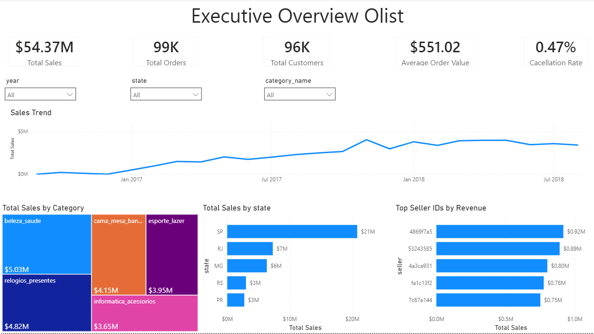
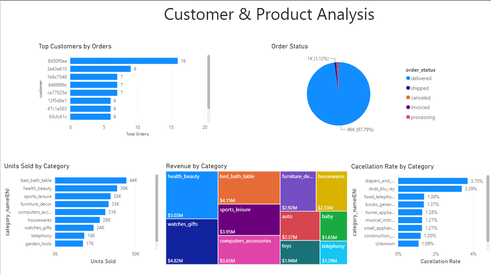
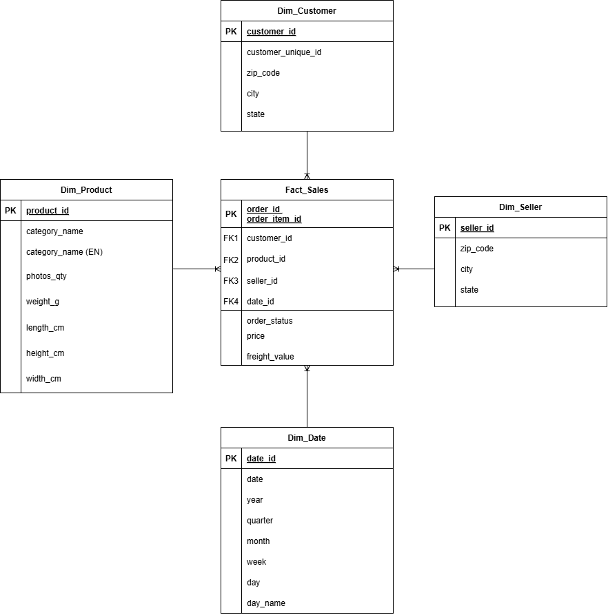

# Olist E-commerce Analytics Pipeline

End-to-end Data Analytics project using **Python, PostgreSQL and Power BI**.

The project transforms raw e-commerce transactional data into a dimensional model for business intelligence, including data cleaning, ETL, SQL analysis and interactive dashboards.





---

## Project Overview

This project follows a complete analytics workflow:

Raw CSV Files
↓

Data Exploration

↓

Data Cleaning

↓

Star Schema Design

↓

ETL with Python

↓

PostgreSQL Data Warehouse

↓

SQL Business Queries

↓

Power BI Dashboard

---

## Business Questions

The analytical model was designed to answer the following business questions:

- How much revenue does the platform generate?
- How have sales evolved over time?
- Which product categories generate the highest revenue?
- Which Brazilian states contribute the most sales?
- Who are the top-performing sellers?
- Which customers purchase most frequently?
- Which product categories sell the most units?
- What percentage of orders are cancelled?
- Which categories have the highest cancellation rates?

---

## Technologies

- Python
- Pandas
- NumPy
- PostgreSQL
- SQL
- Power BI
- Draw.io

---

## Dataset

The project uses the public **Brazilian E-commerce Public Dataset by Olist**, containing information about:

- Customers
- Orders
- Order Items
- Products
- Sellers
- Payments
- Reviews
- Geolocation
- Product Categories

---

## Data Cleaning

Main cleaning tasks included:

- Handling missing values
- Duplicate validation
- Data type conversion
- Date normalization
- Category translation
- Relationship validation
- Primary key validation
- Foreign key validation

---

## Dimensional Model

A Star Schema was designed to optimize analytical queries.

Fact Table

- Fact_Sales

Dimensions

- Dim_Customer
- Dim_Product
- Dim_Seller
- Dim_Date



---

## ETL Process

The ETL pipeline performs:

- Data extraction from CSV files
- Data transformation with Pandas
- Creation of dimension tables
- Construction of the Fact_Sales table
- Data validation
- Export to PostgreSQL

---

## SQL Analysis

Business metrics were calculated using PostgreSQL, including:

- Revenue
- Orders
- Average Order Value
- Top Sellers
- Top Categories
- Cancellation Rate
- Sales by State
- Customer Analysis

---

## Dashboard

The Power BI dashboard contains two pages.

### Executive Overview

- Total Sales
- Total Orders
- Total Customers
- Average Order Value
- Cancellation Rate
- Sales Trend
- Revenue by Category
- Revenue by State
- Top Sellers


### Customer & Product Analysis

- Top Customers
- Order Status
- Units Sold by Category
- Revenue by Category
- Cancellation Rate by Category


---

## Repository Structure

```text
├── data/
├── notebook/
├── dashboard/
├── sql/
├── images/
└── README.md
```

---

## Key Skills Demonstrated

- Exploratory Data Analysis (EDA)
- Data Cleaning
- ETL Development
- Dimensional Modeling
- Star Schema Design
- PostgreSQL
- SQL
- Power BI
- Business Intelligence
- Data Validation

---

## Author

Ivan Santiago Quintero

Electronic and Electrical Engineer transitioning into Data Analytics and Data Engineering.